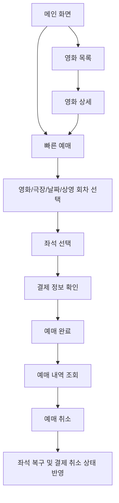
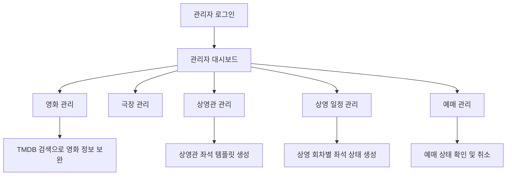
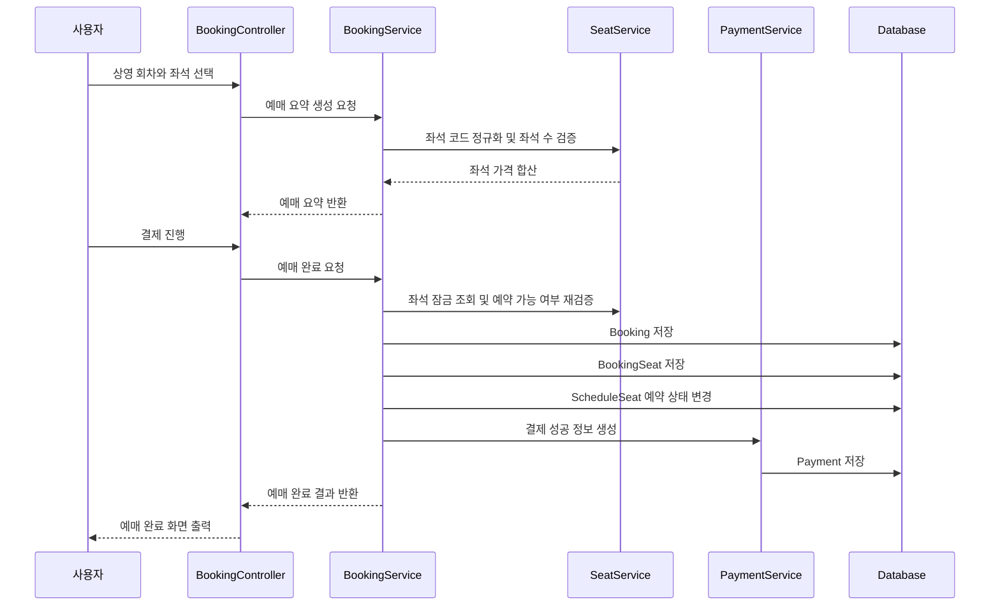
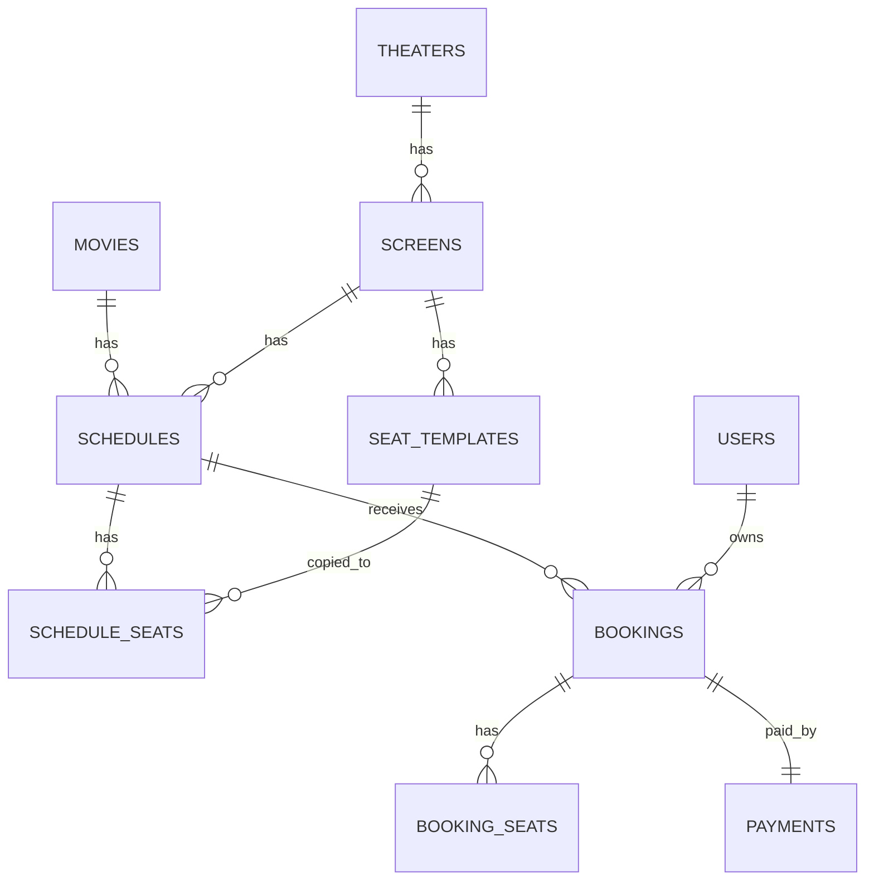
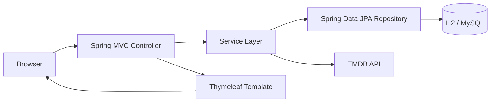

# CineFlow Spring Boot

Spring Boot와 Thymeleaf로 구현한 영화 예매 및 영화관 운영 관리 웹 애플리케이션입니다.

정적 영화 사이트 템플릿을 단순히 페이지 단위로 옮긴 프로젝트가 아니라, 영화 조회, 상영 일정 선택, 좌석 선택, 결제 처리, 예매 내역 조회, 예매 취소, 관리자 운영 기능을 서버 중심 데이터 흐름으로 다시 구성한 프로젝트입니다.

사용자는 영화 목록과 상세 정보를 확인한 뒤 예매 가능한 상영 회차를 선택하고, 좌석과 인원을 확정한 다음 예매를 완료할 수 있습니다. 관리자는 영화, 극장, 상영관, 상영 일정, 예매 상태를 관리할 수 있습니다.

## 프로젝트 요약

| 항목 | 내용 |
| --- | --- |
| 프로젝트명 | CineFlow |
| 개발 형태 | 개인 프로젝트 |
| 주제 | 영화 예매 및 영화관 운영 관리 웹 서비스 |
| 주요 사용자 | 일반 사용자, 비회원 예매자, 로그인 회원, 관리자 |
| Backend | Java 17, Spring Boot 3.4.4 |
| View | Thymeleaf, HTML, CSS, JavaScript |
| Persistence | Spring Data JPA |
| Security | Spring Security, BCrypt |
| Database | H2(dev), MySQL(local) |
| Migration | Flyway |
| External API | TMDB API |
| 핵심 구현 | 영화 탐색, 빠른 예매, 좌석 선택, 결제 상태 생성, 예매 조회/취소, 관리자 CRUD |

## 기술 스택

### Backend

| 기술 | 사용 목적 |
| --- | --- |
| Java 17 | Spring Boot 3.x 실행 환경 |
| Spring Boot 3.4.4 | 웹 애플리케이션 기반 |
| Spring MVC | Controller 기반 요청 처리 |
| Spring Data JPA | Entity와 Repository 기반 데이터 접근 |
| Spring Security | 로그인, 권한 분리, 접근 제어 |
| Bean Validation | 회원가입/관리자 폼 입력값 검증 |
| Lombok | DTO, Entity, Service 코드 간결화 |
| RestClient | TMDB API 호출 |
| Flyway | DB 스키마 버전 관리 |

### Frontend

| 기술 | 사용 목적 |
| --- | --- |
| Thymeleaf | 서버 사이드 렌더링 |
| Thymeleaf Security Extras | 로그인 여부와 권한에 따른 화면 분기 |
| HTML/CSS | 사용자 화면 및 관리자 화면 구성 |
| JavaScript | 좌석 선택, 예매 폼, 관리자 TMDB 검색 보조 |

### Database

| 환경 | DB | 특징 |
| --- | --- | --- |
| dev | H2 in-memory | 빠른 실행, H2 Console, seed 데이터 자동 생성 |
| local | MySQL | 운영형 로컬 DB 검증, Flyway validate 사용 |

## 프로젝트 목적

CineFlow의 목표는 단순한 영화 목록 사이트가 아니라, 영화관 예매 서비스에서 필요한 핵심 데이터 흐름을 직접 구현하는 것입니다.

중점적으로 구현한 부분은 다음과 같습니다.

| 구분 | 구현 목표 |
| --- | --- |
| 영화 탐색 | TMDB 메타데이터와 로컬 영화 데이터를 함께 사용 |
| 예매 흐름 | 영화, 극장, 날짜, 상영 회차, 좌석, 결제 순서로 연결 |
| 좌석 관리 | 상영관 좌석 템플릿과 상영 회차별 좌석 상태 분리 |
| 결제 처리 | 실제 PG 대신 내부 결제 성공/취소 상태를 생성 |
| 예매 조회 | 회원 예매와 비회원 예매 조회 흐름 분리 |
| 예매 취소 | 상영 시작 전, 결제 완료 상태일 때만 취소 허용 |
| 관리자 운영 | 영화, 극장, 상영관, 상영 일정, 예매를 관리 |
| 환경 분리 | H2 개발 환경과 MySQL 로컬 환경 분리 |

## 주요 기능

### 1. 메인 화면

메인 화면은 TMDB 영화 목록과 로컬 영화 데이터를 조합해서 구성됩니다.

구현 내용은 다음과 같습니다.

| 기능 | 설명 |
| --- | --- |
| 히어로 영화 | TMDB popular 기반 대표 영화 노출 |
| 박스오피스 영역 | TMDB popular 또는 로컬 활성 영화 사용 |
| 현재 상영작 | TMDB now playing 또는 로컬 현재 상영작 사용 |
| 개봉 예정작 | TMDB upcoming 또는 로컬 개봉 예정작 사용 |
| fallback | TMDB 토큰이 없거나 API 호출이 실패해도 로컬 데이터로 화면 유지 |

관련 파일은 다음과 같습니다.

| 파일 | 역할 |
| --- | --- |
| `src/main/java/com/cineflow/controller/HomeController.java` | 메인 화면 요청 처리, 섹션별 영화 모델 주입 |
| `src/main/java/com/cineflow/service/PublicMovieMetadataService.java` | TMDB/로컬 영화 메타데이터 통합, fallback 처리 |
| `src/main/java/com/cineflow/service/TmdbClient.java` | TMDB API 호출 |
| `src/main/resources/templates/index.html` | 메인 화면 템플릿 |

### 2. 영화 목록 및 상세

영화 목록은 현재 상영, 인기 영화, 개봉 예정, 로컬 활성 영화를 병합해서 구성됩니다.

영화 상세에서는 영화 정보뿐 아니라 로컬 영화와 연결된 경우 상영 일정, 극장, 다음 상영 회차까지 함께 제공합니다.

| 기능 | 설명 |
| --- | --- |
| 영화 목록 | `/movies`에서 영화 카드 목록 제공 |
| 영화 상세 | `/movies/{id}`에서 상세 정보 제공 |
| 로컬 영화 연결 | 로컬 영화 ID 또는 TMDB ID 기준으로 연결 |
| 상영 정보 연결 | 연결된 로컬 영화가 있으면 극장/상영 일정 표시 |
| 관련 영화 | TMDB popular 기반 관련 영화 제공 |
| 레거시 URL | `/movielist.html`, `/moviesingle.html` 요청을 새 URL로 redirect |

관련 파일은 다음과 같습니다.

| 파일 | 역할 |
| --- | --- |
| `src/main/java/com/cineflow/controller/MovieController.java` | 영화 목록/상세 라우팅 |
| `src/main/java/com/cineflow/service/MovieService.java` | 로컬 영화 조회 및 관리자 영화 관리 |
| `src/main/java/com/cineflow/service/PublicMovieMetadataService.java` | 공개 화면용 영화 메타데이터 구성 |
| `src/main/java/com/cineflow/service/ScheduleService.java` | 영화별 상영 일정 조회 |
| `src/main/resources/templates/movies/list.html` | 영화 목록 화면 |
| `src/main/resources/templates/movies/detail.html` | 영화 상세 화면 |

### 3. 빠른 예매

빠른 예매는 영화, 극장, 날짜, 상영 회차를 단계적으로 선택하는 진입 화면입니다.

선택값이 없으면 예매 가능한 첫 영화와 날짜를 기준으로 기본 상태를 구성합니다. `scheduleId`가 전달되면 해당 회차를 기준으로 영화, 극장, 날짜를 역산해 선택 상태를 맞춥니다.

| 기능 | 설명 |
| --- | --- |
| 영화 선택 | 예매 가능한 영화 목록 조회 |
| 극장 선택 | 선택 영화 기준 극장 목록 조회 |
| 날짜 선택 | 선택 영화/극장 기준 예매 가능 날짜 조회 |
| 상영 회차 선택 | 선택 조건에 맞는 상영 회차 조회 |
| 좌석 선택 이동 | 선택한 회차 기준 `/booking/seat`로 이동 |
| 레거시 URL | `/booking.html` 요청을 `/booking`으로 redirect |

관련 파일은 다음과 같습니다.

| 파일 | 역할 |
| --- | --- |
| `src/main/java/com/cineflow/controller/BookingController.java` | 예매 화면 흐름 제어 |
| `src/main/java/com/cineflow/service/MovieService.java` | 예매 가능한 영화 조회 |
| `src/main/java/com/cineflow/service/TheaterService.java` | 영화별 극장 조회 |
| `src/main/java/com/cineflow/service/ScheduleService.java` | 날짜/상영 회차 조회 |
| `src/main/resources/templates/booking/quick.html` | 빠른 예매 화면 |

### 4. 좌석 선택

좌석은 상영관의 좌석 템플릿과 상영 회차별 좌석 상태를 분리해서 관리합니다.

상영관에는 기본 좌석 구조가 `seat_templates`로 저장되고, 실제 예매 가능 여부는 각 상영 회차의 `schedule_seats`에서 관리됩니다. 이 구조를 사용하면 같은 상영관이라도 상영 회차마다 좌석 예약 상태를 독립적으로 유지할 수 있습니다.

| 기능 | 설명 |
| --- | --- |
| 좌석 배치 생성 | 상영관 총 좌석 수 기준으로 좌석 템플릿 생성 |
| 회차별 좌석 생성 | 상영 일정 생성 시 schedule_seats 생성 |
| 좌석 상태 조회 | 예약 완료 좌석 비활성화 |
| 좌석 코드 정규화 | A1, a1, `A1,A2` 같은 입력을 정규화 |
| 좌석 수 검증 | 선택 좌석 수와 관람 인원 수 일치 검증 |
| 좌석 가격 계산 | 좌석 타입별 가격 합산 |
| 좌석 잠금 조회 | 예매 완료 시점에 좌석을 다시 검증 |
| 취소 복구 | 예매 취소 시 예약 좌석을 다시 사용 가능 상태로 변경 |

좌석 타입별 가격 정책은 다음과 같습니다.

| 좌석 타입 | 가격 정책 |
| --- | --- |
| STANDARD | 상영 회차 기본 가격 |
| PREMIUM | 기본 가격 + 3,000원 |
| COUPLE | 기본 가격 + 5,000원 |

관련 파일은 다음과 같습니다.

| 파일 | 역할 |
| --- | --- |
| `src/main/java/com/cineflow/service/SeatService.java` | 좌석 배치, 좌석 검증, 가격 계산, 예약/복구 처리 |
| `src/main/java/com/cineflow/repository/ScheduleSeatRepository.java` | 회차별 좌석 조회 및 잠금 조회 |
| `src/main/java/com/cineflow/domain/SeatTemplate.java` | 상영관 기준 좌석 템플릿 |
| `src/main/java/com/cineflow/domain/ScheduleSeat.java` | 상영 회차별 좌석 상태 |
| `src/main/resources/templates/booking/seat.html` | 좌석 선택 화면 |

### 5. 결제 및 예매 완료

결제는 실제 PG 연동 대신 프로젝트 내부에서 결제 성공/취소 상태를 생성하는 방식으로 구현되어 있습니다.

예매 완료 시 예매 정보, 좌석 스냅샷, 결제 정보가 함께 저장됩니다.

| 데이터 | 설명 |
| --- | --- |
| Booking | 예매자, 영화, 극장, 상영관, 인원, 총액, 상태 저장 |
| BookingSeat | 예매 시점의 좌석 코드, 행, 번호, 타입, 가격 저장 |
| ScheduleSeat | 선택 좌석을 reserved 상태로 변경 |
| Payment | 결제 수단, 금액, 결제 상태, 거래번호 저장 |
| Schedule | 잔여 좌석 수 갱신 |

예매 코드와 거래번호는 다음 형식으로 생성됩니다.

```text
CFyyyyMMdd-HHmm-XXXX
PAY-yyyyMMddHHmmss-XXXXXX
CAN-yyyyMMddHHmmss-XXXXXX
```

관련 파일은 다음과 같습니다.

| 파일 | 역할 |
| --- | --- |
| `src/main/java/com/cineflow/service/BookingService.java` | 예매 요약 생성, 예매 완료, 예매 취소 |
| `src/main/java/com/cineflow/service/PaymentService.java` | 결제 성공/취소 상태 생성 |
| `src/main/java/com/cineflow/dto/BookingRequestDto.java` | 예매 요청 데이터 |
| `src/main/java/com/cineflow/dto/BookingSummaryDto.java` | 결제 전 예매 요약 데이터 |
| `src/main/resources/templates/booking/payment.html` | 결제 화면 |
| `src/main/resources/templates/booking/complete.html` | 예매 완료 화면 |

### 6. 예매 내역 조회 및 취소

예매 내역은 회원과 비회원 흐름을 분리했습니다.

회원은 로그인 후 본인 예매 내역을 확인할 수 있고, 비회원은 예매번호와 연락처를 기반으로 예매를 조회할 수 있습니다.

| 기능 | 설명 |
| --- | --- |
| 현재 예매 | 상영 시작 전 예매 분리 |
| 지난 예매 | 상영 시간이 지난 예매 분리 |
| 취소 예매 | 취소 상태 예매 분리 |
| 회원 조회 | 로그인 사용자 ID 기준 조회 |
| 비회원 조회 | 예매번호와 연락처 기준 조회 |
| 접근 제어 | 회원 예매는 본인 또는 관리자만 접근 가능 |
| 취소 제한 | 상영 시작 전, 결제 완료, 예매 완료 상태일 때만 취소 |
| 좌석 복구 | 취소 시 schedule_seats reserved 해제 |
| 결제 취소 | payments 상태를 CANCELED로 변경 |

관련 파일은 다음과 같습니다.

| 파일 | 역할 |
| --- | --- |
| `src/main/java/com/cineflow/controller/BookingController.java` | 예매 내역 조회, 예매 취소 요청 처리 |
| `src/main/java/com/cineflow/service/BookingService.java` | 예매 접근 검증, 취소 가능 여부 검증, 취소 처리 |
| `src/main/java/com/cineflow/service/SeatService.java` | 취소 좌석 복구 |
| `src/main/java/com/cineflow/service/PaymentService.java` | 결제 취소 처리 |
| `src/main/resources/templates/booking/history.html` | 예매 내역 화면 |

### 7. 회원가입 및 로그인

인증/인가는 Spring Security 기반으로 구성했습니다.

| 기능 | 설명 |
| --- | --- |
| 회원가입 | 로그인 ID, 이메일, 비밀번호, 이름, 연락처 입력 |
| 중복 검사 | 로그인 ID와 이메일 중복 검사 |
| 비밀번호 확인 | 비밀번호와 비밀번호 확인 일치 검증 |
| 암호화 저장 | BCrypt로 비밀번호 암호화 |
| 권한 분리 | USER, ADMIN 역할 분리 |
| 로그인 사용자 예매 | 예매 시 회원 이름/연락처 자동 반영 |
| 관리자 접근 제어 | `/admin/**`은 ADMIN 권한만 접근 가능 |
| 마이페이지 보호 | `/mypage/**`는 로그인 사용자만 접근 가능 |
| 예매 API 보호 | `/api/bookings/**`는 로그인 사용자만 접근 가능 |

관련 파일은 다음과 같습니다.

| 파일 | 역할 |
| --- | --- |
| `src/main/java/com/cineflow/controller/AuthController.java` | 로그인/회원가입 화면 처리 |
| `src/main/java/com/cineflow/service/UserService.java` | 회원가입, 관리자 계정 생성, 사용자 조회 |
| `src/main/java/com/cineflow/config/SecurityConfig.java` | 접근 권한, 로그인, 로그아웃, 예외 페이지 설정 |
| `src/main/java/com/cineflow/security/AuthenticatedUser.java` | Spring Security Principal |
| `src/main/resources/templates/auth/login.html` | 로그인 화면 |
| `src/main/resources/templates/auth/signup.html` | 회원가입 화면 |
| `src/main/resources/templates/auth/access-denied.html` | 접근 거부 화면 |

### 8. 관리자 기능

관리자 화면은 영화관 운영 데이터를 관리하기 위한 기능으로 구성되어 있습니다.

| 관리 대상 | 구현 내용 |
| --- | --- |
| 대시보드 | 영화 수, 상영 일정 수, 예매 수, 매출, 오늘 일정 집계 |
| 영화 | 등록, 수정, 비활성화, TMDB 검색 보조 |
| 극장 | 등록, 수정, 비활성화 |
| 상영관 | 등록, 수정, 비활성화, 좌석 템플릿 생성 |
| 상영 일정 | 등록, 수정, 비활성화, 중복 시간 검증 |
| 예매 | 상태/영화/극장/날짜 필터링, 관리자 취소 |
| 회차 상세 | 예약 좌석 수, 잔여 좌석 수, 좌석 배치, 예매 목록 확인 |

관련 파일은 다음과 같습니다.

| 파일 | 역할 |
| --- | --- |
| `src/main/java/com/cineflow/controller/AdminController.java` | 관리자 대시보드, 예매 관리, 일정 상세 |
| `src/main/java/com/cineflow/controller/AdminManagementController.java` | 영화/극장/상영관/상영 일정 CRUD |
| `src/main/java/com/cineflow/controller/AdminMovieTmdbController.java` | 관리자 TMDB 검색 API |
| `src/main/java/com/cineflow/service/MovieService.java` | 영화 관리 |
| `src/main/java/com/cineflow/service/TheaterService.java` | 극장 관리 |
| `src/main/java/com/cineflow/service/ScreenService.java` | 상영관 관리 |
| `src/main/java/com/cineflow/service/ScheduleService.java` | 상영 일정 관리 |
| `src/main/resources/templates/admin/index.html` | 관리자 대시보드 |
| `src/main/resources/templates/admin/bookings.html` | 예매 관리 |
| `src/main/resources/templates/admin/movies.html` | 영화 관리 |
| `src/main/resources/templates/admin/theaters.html` | 극장 관리 |
| `src/main/resources/templates/admin/screens.html` | 상영관 관리 |
| `src/main/resources/templates/admin/schedules.html` | 상영 일정 관리 |
| `src/main/resources/templates/admin/schedule-detail.html` | 상영 회차 상세 |

## 사용자 흐름



## 관리자 흐름



## 예매 생성 흐름



## 예매 취소 흐름

```mermaid
sequenceDiagram
    participant Actor as 사용자/관리자
    participant Controller as BookingController/AdminController
    participant Booking as BookingService
    participant Seat as SeatService
    participant Payment as PaymentService
    participant DB as Database

    Actor->>Controller: 예매 취소 요청
    Controller->>Booking: 예매 코드와 취소 사유 전달
    Booking->>Booking: 접근 권한 검증
    Booking->>Booking: 취소 가능 상태 검증
    Booking->>Payment: 결제 취소 상태 반영
    Booking->>Seat: 예약 좌석 복구
    Booking->>DB: Booking 상태 CANCELED 저장
    Booking-->>Controller: 취소 결과 반환
    Controller-->>Actor: 취소 완료 메시지 출력
```

## DB 설계 요약

Flyway 마이그레이션과 JPA Entity를 함께 사용합니다.

주요 테이블은 다음과 같습니다.

| 테이블 | 역할 |
| --- | --- |
| `movies` | 영화 기본 정보, TMDB 연결 정보, 상영 상태 |
| `theaters` | 극장 정보 |
| `screens` | 극장 내부 상영관 정보 |
| `seat_templates` | 상영관 기준 좌석 템플릿 |
| `schedules` | 영화 상영 회차 |
| `schedule_seats` | 상영 회차별 좌석 예약 상태 |
| `bookings` | 예매 정보 |
| `booking_seats` | 예매 시점 좌석 스냅샷 |
| `payments` | 결제 성공/취소 정보 |
| `users` | 회원 및 관리자 계정 |

ERD 개요는 다음과 같습니다.



주요 제약 조건과 인덱스는 다음과 같습니다.

| 대상 | 목적 |
| --- | --- |
| `bookings.booking_code` unique | 예매번호 중복 방지 |
| `payments.booking_id` unique | 예매 1건당 결제 1건 연결 |
| `payments.transaction_id` unique | 결제 거래번호 중복 방지 |
| `seat_templates(screen_id, seat_code)` unique | 상영관 내 좌석 코드 중복 방지 |
| `schedule_seats(schedule_id, seat_template_id)` unique | 회차별 좌석 상태 중복 방지 |
| `booking_seats(booking_id, seat_code)` unique | 하나의 예매 안에서 좌석 중복 방지 |
| `bookings.user_id` index | 회원별 예매 조회 최적화 |
| `schedules.start_time` index | 날짜/시간 기반 상영 일정 조회 최적화 |
| `schedule_seats(schedule_id, reserved)` index | 회차별 잔여 좌석 조회 최적화 |

## URL 설계

### 사용자 화면

| Method | URL | 설명 |
| --- | --- | --- |
| GET | `/` | 메인 화면 |
| GET | `/movies` | 영화 목록 |
| GET | `/movies/{id}` | 영화 상세 |
| GET | `/booking` | 빠른 예매 |
| GET | `/booking/seat` | 좌석 선택 |
| POST | `/booking/payment` | 좌석 선택 후 결제 화면 이동 |
| GET | `/booking/payment` | 결제 화면 |
| POST | `/booking/complete` | 예매 완료 처리 |
| GET | `/booking/complete` | 예매 완료/결과 화면 |
| GET | `/booking/history` | 비회원 또는 공통 예매 조회 |
| POST | `/booking/cancel` | 사용자 예매 취소 |
| GET | `/mypage/bookings` | 로그인 회원 예매 내역 |
| GET | `/support` | 고객지원 |
| GET | `/login` | 로그인 |
| POST | `/login` | 로그인 처리 |
| GET | `/signup` | 회원가입 |
| POST | `/signup` | 회원가입 처리 |
| GET | `/access-denied` | 접근 거부 페이지 |

### 관리자 화면

| Method | URL | 설명 |
| --- | --- | --- |
| GET | `/admin` | 관리자 대시보드 |
| GET | `/admin/bookings` | 예매 관리 |
| POST | `/admin/bookings/{bookingCode}/cancel` | 관리자 예매 취소 |
| GET | `/admin/schedules` | 상영 일정 관리 |
| GET | `/admin/schedules/{id}` | 상영 회차 상세 |
| GET | `/admin/schedules/new` | 상영 일정 등록 화면 |
| POST | `/admin/schedules` | 상영 일정 등록 |
| GET | `/admin/schedules/{id}/edit` | 상영 일정 수정 화면 |
| POST | `/admin/schedules/{id}` | 상영 일정 수정 |
| POST | `/admin/schedules/{id}/delete` | 상영 일정 비활성화 |
| GET | `/admin/movies` | 영화 관리 |
| GET | `/admin/movies/new` | 영화 등록 화면 |
| POST | `/admin/movies` | 영화 등록 |
| GET | `/admin/movies/{id}/edit` | 영화 수정 화면 |
| POST | `/admin/movies/{id}` | 영화 수정 |
| POST | `/admin/movies/{id}/delete` | 영화 비활성화 |
| GET | `/admin/theaters` | 극장 관리 |
| GET | `/admin/theaters/new` | 극장 등록 화면 |
| POST | `/admin/theaters` | 극장 등록 |
| GET | `/admin/theaters/{id}/edit` | 극장 수정 화면 |
| POST | `/admin/theaters/{id}` | 극장 수정 |
| POST | `/admin/theaters/{id}/delete` | 극장 비활성화 |
| GET | `/admin/screens` | 상영관 관리 |
| GET | `/admin/screens/new` | 상영관 등록 화면 |
| POST | `/admin/screens` | 상영관 등록 |
| GET | `/admin/screens/{id}/edit` | 상영관 수정 화면 |
| POST | `/admin/screens/{id}` | 상영관 수정 |
| POST | `/admin/screens/{id}/delete` | 상영관 비활성화 |

### JSON API

| Method | URL | 인증 | 설명 |
| --- | --- | --- | --- |
| GET | `/api/movies` | 불필요 | 영화 목록 JSON 조회 |
| GET | `/api/movies/{id}` | 불필요 | 영화 단건 JSON 조회 |
| GET | `/api/bookings/current` | 필요 | 로그인 사용자의 현재 예매 조회 |
| GET | `/api/bookings/past` | 필요 | 로그인 사용자의 지난 예매 조회 |
| GET | `/admin/movies/tmdb/search` | 관리자 | TMDB 영화 검색 |
| GET | `/admin/movies/tmdb/{tmdbId}` | 관리자 | TMDB 영화 상세 조회 |

### 레거시 URL 호환

기존 정적 템플릿 URL 중 실제 서비스 흐름으로 연결 가능한 URL은 새 라우트로 redirect합니다.

| 기존 URL | 연결 URL |
| --- | --- |
| `/index.html` | `/` |
| `/movielist.html` | `/movies` |
| `/moviegrid.html` | `/movies` |
| `/moviegrid_light.html` | `/movies` |
| `/moviegridfw.html` | `/movies` |
| `/moviegridfw_light.html` | `/movies` |
| `/movielist_light.html` | `/movies` |
| `/moviesingle.html?id=...` | `/movies/{id}` |
| `/moviesingle_light.html?id=...` | `/movies/{id}` |
| `/booking.html` | `/booking` |
| `/booking-seat.html` | `/booking/seat` |
| `/booking-payment.html` | `/booking/payment` |
| `/booking-complete.html` | `/booking/complete` |
| `/booking-history.html` | `/booking/history` |
| `/support.html` | `/support` |

서비스 범위에 포함하지 않는 일부 템플릿 URL은 404로 처리합니다.

## 아키텍처



계층별 책임은 다음과 같습니다.

| 계층 | 책임 |
| --- | --- |
| Controller | 요청 파라미터 처리, 화면 모델 구성, redirect 흐름 제어 |
| Service | 예매 검증, 좌석 처리, 결제 상태 처리, 관리자 운영 로직 |
| Repository | JPA 기반 데이터 조회/저장 |
| Domain | 영화, 극장, 상영관, 좌석, 예매, 결제, 회원 엔티티 |
| DTO/Form | 화면 출력 데이터와 폼 입력 데이터 전달 |
| Template | 사용자 화면과 관리자 화면 렌더링 |
| Config | 보안, TMDB, seed 데이터, 환경 설정 |

## 패키지 구조

```text
src/main/java/com/cineflow
├── api
│   ├── BookingApiController.java
│   └── MovieApiController.java
├── config
│   ├── AuthSeedInitializer.java
│   ├── DataInitializer.java
│   ├── RestClientConfig.java
│   ├── SecurityConfig.java
│   └── TmdbProperties.java
├── controller
│   ├── AdminController.java
│   ├── AdminManagementController.java
│   ├── AdminMovieTmdbController.java
│   ├── AuthController.java
│   ├── BookingController.java
│   ├── HomeController.java
│   ├── LegacyTemplateController.java
│   ├── MovieController.java
│   └── SupportController.java
├── domain
│   ├── Booking.java
│   ├── BookingSeat.java
│   ├── Movie.java
│   ├── Payment.java
│   ├── Schedule.java
│   ├── ScheduleSeat.java
│   ├── Screen.java
│   ├── SeatTemplate.java
│   ├── Theater.java
│   └── User.java
├── dto
├── repository
├── security
└── service
```

```text
src/main/resources
├── db/migration
│   ├── V1__init_schema.sql
│   ├── V2__indexes_and_constraints.sql
│   ├── V3__auth_schema.sql
│   └── V4__booking_user_relation.sql
├── templates
│   ├── admin
│   ├── auth
│   ├── booking
│   ├── movies
│   ├── support
│   ├── 404.html
│   └── index.html
├── application.yml
├── application-dev.yml
└── application-local.yml
```

## 구현 근거

### 예매 도메인

| 구현 내용 | 파일/메서드 |
| --- | --- |
| 예매 요약 생성 | `BookingService.createBookingSummary()` |
| 예매 완료 처리 | `BookingService.completeBooking()` |
| 예매 코드 생성 | `BookingService.generateBookingCode()` |
| 예매 취소 처리 | `BookingService.cancelBooking()` |
| 회원/관리자/비회원 접근 검증 | `BookingService.canAccessBooking()` |
| 취소 가능 여부 검증 | `BookingService.validateCancelable()` |
| 현재/지난/취소 예매 분리 | `BookingService.getCurrentBookingsForUser()`, `getPastBookingsForUser()`, `getCanceledBookingsForUser()` |

### 좌석 도메인

| 구현 내용 | 파일/메서드 |
| --- | --- |
| 좌석 배치 조회 | `SeatService.getSeatLayout()` |
| 예약 좌석 조회 | `SeatService.getReservedSeatCodes()` |
| 좌석 템플릿 생성 | `SeatService.syncSeatTemplatesForScreen()` |
| 회차별 좌석 상태 재생성 | `SeatService.rebuildScheduleSeatsForSchedule()` |
| 좌석 코드 정규화 | `SeatService.normalizeSeatCodes()` |
| 좌석 선택 검증 | `SeatService.validateSeatSelection()` |
| 좌석 가격 계산 | `SeatService.calculateTotalPrice()` |
| 예매 완료 전 좌석 잠금 조회 | `SeatService.lockSeatsForReservation()` |
| 예매 취소 시 좌석 복구 | `SeatService.releaseReservedSeatsForBooking()` |

### 결제 도메인

| 구현 내용 | 파일/메서드 |
| --- | --- |
| 결제 성공 상태 생성 | `PaymentService.processSuccessfulPayment()` |
| 결제 취소 상태 변경 | `PaymentService.cancelPayment()` |
| 결제 거래번호 생성 | `PaymentService.generateTransactionId()` |
| 취소 거래번호 생성 | `PaymentService.generateCancelTransactionId()` |

### 영화 메타데이터

| 구현 내용 | 파일/메서드 |
| --- | --- |
| 메인 히어로 영화 구성 | `HomeController.home()` |
| 공개 영화 목록 병합 | `PublicMovieMetadataService.getMovieList()` |
| 로컬 영화 fallback | `PublicMovieMetadataService.resolveLocalMetadata()` |
| TMDB popular 조회 | `TmdbClient.getPopularMovies()` |
| TMDB now playing 조회 | `TmdbClient.getNowPlayingMovies()` |
| TMDB upcoming 조회 | `TmdbClient.getUpcomingMovies()` |
| TMDB 검색 | `TmdbClient.searchMovies()` |
| TMDB 상세 조회 | `TmdbClient.getMovieDetailWithMedia()` |

### 관리자 운영

| 구현 내용 | 파일/메서드 |
| --- | --- |
| 관리자 대시보드 집계 | `AdminController.index()` |
| 관리자 예매 필터링 | `AdminController.bookings()` |
| 상영 회차 상세 | `AdminController.scheduleDetail()` |
| 영화 등록/수정/비활성화 | `AdminManagementController` + `MovieService` |
| 극장 등록/수정/비활성화 | `AdminManagementController` + `TheaterService` |
| 상영관 등록/수정/비활성화 | `AdminManagementController` + `ScreenService` |
| 상영 일정 등록/수정/비활성화 | `AdminManagementController` + `ScheduleService` |
| 관리자 TMDB 검색 | `AdminMovieTmdbController` + `AdminMovieTmdbService` |

### 인증/인가

| 구현 내용 | 파일/메서드 |
| --- | --- |
| 회원가입 화면/처리 | `AuthController.signupForm()`, `AuthController.signup()` |
| 로그인 설정 | `SecurityConfig.securityFilterChain()` |
| 권한별 접근 제어 | `SecurityConfig.securityFilterChain()` |
| 비밀번호 암호화 | `SecurityConfig.passwordEncoder()` |
| 사용자 조회 | `UserService.loadUserByUsername()` |
| 관리자 seed 생성 | `AuthSeedInitializer.initAuthSeed()` |

## 환경 설정

기본 설정 파일은 다음과 같이 분리되어 있습니다.

| 파일 | 역할 |
| --- | --- |
| `application.yml` | 공통 설정, 기본 profile, port, JPA 공통 설정, Flyway, TMDB |
| `application-dev.yml` | H2 개발 환경, H2 Console, seed 활성화 |
| `application-local.yml` | MySQL 로컬 환경, Flyway validate, seed 선택 활성화 |

### 공통 설정

| 설정 | 값 |
| --- | --- |
| 기본 profile | `${SPRING_PROFILES_ACTIVE:dev}` |
| 서버 포트 | `8080` |
| JPA open-in-view | `false` |
| Flyway locations | `classpath:db/migration` |
| TMDB token | `${TMDB_BEARER_TOKEN:}` |

### dev profile

개발용 H2 메모리 DB를 사용합니다.

| 설정 | 값 |
| --- | --- |
| DB URL | `jdbc:h2:mem:cineflow;MODE=MySQL;DB_CLOSE_DELAY=-1;DB_CLOSE_ON_EXIT=FALSE` |
| H2 Console | `/h2-console` |
| Hibernate ddl-auto | `update` |
| seed | `app.seed.enabled=true` |

dev profile에서는 실행 시 영화, 극장, 상영관, 상영 일정, 좌석, 예매 샘플 데이터와 관리자 계정을 생성합니다.

기본 관리자 계정은 다음과 같습니다.

| 항목 | 값 |
| --- | --- |
| ID | `admin` |
| Password | `admin1234!` |

### local profile

로컬 MySQL을 사용합니다.

| 설정 | 값 |
| --- | --- |
| DB | MySQL |
| Hibernate ddl-auto | `validate` |
| Flyway | enabled |
| seed | `${APP_SEED_ENABLED:false}` |

local profile에서 사용하는 환경 변수는 다음과 같습니다.

| 환경 변수 | 기본값 |
| --- | --- |
| `MYSQL_HOST` | `localhost` |
| `MYSQL_PORT` | `3306` |
| `MYSQL_DATABASE` | `cineflow` |
| `MYSQL_USERNAME` | `root` |
| `MYSQL_PASSWORD` | `change-me` |
| `APP_SEED_ENABLED` | `false` |
| `TMDB_BEARER_TOKEN` | 빈 값 |

## 실행 방법

### 1. dev profile 실행

H2 메모리 DB와 seed 데이터를 사용해 바로 확인할 수 있습니다.

Windows PowerShell:

```powershell
.\gradlew.bat bootRun --args="--spring.profiles.active=dev"
```

macOS/Linux:

```bash
./gradlew bootRun --args="--spring.profiles.active=dev"
```

접속 URL:

```text
http://localhost:8080
```

H2 Console:

```text
http://localhost:8080/h2-console
```

### 2. TMDB API 사용

TMDB 연동은 선택 사항입니다. 토큰이 없으면 로컬 fallback 데이터로 화면을 렌더링합니다.

Windows PowerShell:

```powershell
$env:TMDB_BEARER_TOKEN="your_tmdb_bearer_token"
.\gradlew.bat bootRun --args="--spring.profiles.active=dev"
```

macOS/Linux:

```bash
export TMDB_BEARER_TOKEN="your_tmdb_bearer_token"
./gradlew bootRun --args="--spring.profiles.active=dev"
```

### 3. local profile 실행

MySQL을 사용하는 로컬 실행 방식입니다.

Windows PowerShell:

```powershell
$env:SPRING_PROFILES_ACTIVE="local"
$env:MYSQL_HOST="localhost"
$env:MYSQL_PORT="3306"
$env:MYSQL_DATABASE="cineflow"
$env:MYSQL_USERNAME="root"
$env:MYSQL_PASSWORD="your_password"
$env:APP_SEED_ENABLED="true"
$env:TMDB_BEARER_TOKEN="your_tmdb_bearer_token"

.\gradlew.bat bootRun
```

macOS/Linux:

```bash
export SPRING_PROFILES_ACTIVE=local
export MYSQL_HOST=localhost
export MYSQL_PORT=3306
export MYSQL_DATABASE=cineflow
export MYSQL_USERNAME=root
export MYSQL_PASSWORD=your_password
export APP_SEED_ENABLED=true
export TMDB_BEARER_TOKEN=your_tmdb_bearer_token

./gradlew bootRun
```

## 테스트

Gradle Wrapper로 테스트를 실행합니다.

Windows PowerShell:

```powershell
.\gradlew.bat test
```

macOS/Linux:

```bash
./gradlew test
```

## 포트폴리오 관점의 핵심 포인트

이 프로젝트에서 강조할 수 있는 구현 포인트는 다음과 같습니다.

| 포인트 | 설명 |
| --- | --- |
| 예매 도메인 구현 | 단순 화면 이동이 아니라 예매 생성, 좌석 점유, 결제 상태, 취소 복구까지 연결 |
| 좌석 상태 분리 | 좌석 템플릿과 회차별 좌석 상태를 분리해 같은 상영관의 여러 회차를 독립 관리 |
| 회원/비회원 흐름 분리 | 로그인 회원 예매와 비회원 예매 조회 방식을 분리 |
| 관리자 운영 화면 | 영화, 극장, 상영관, 일정, 예매를 관리자 화면에서 관리 |
| 외부 API fallback | TMDB API가 없어도 로컬 데이터로 화면이 깨지지 않게 처리 |
| 환경 분리 | H2 개발 환경과 MySQL 로컬 환경을 profile로 분리 |
| 보안 적용 | Spring Security 기반 로그인, BCrypt 암호화, ADMIN 권한 제어 적용 |
| DB 제약 조건 | 예매번호, 결제 거래번호, 좌석 중복 방지 제약 조건 구성 |

## 향후 개선 가능 사항

| 개선 항목 | 설명 |
| --- | --- |
| 실제 PG 연동 | 현재 내부 결제 성공 처리 방식을 실제 결제 모듈과 연결 |
| 좌석 임시 선점 만료 | held, holdExpiresAt 필드를 활용해 결제 대기 좌석 자동 해제 구현 |
| 관리자 문구 정리 | 일부 관리자 success message의 영문 문구를 한국어로 통일 |
| 테스트 보강 | 예매 완료, 예매 취소, 좌석 복구, 권한 검증 단위 테스트 추가 |
| 운영 배포 설정 | MySQL 운영 DB, 환경 변수, 로깅, 배포 프로파일 분리 |
| 마이그레이션 정합성 점검 | Entity 변경 사항과 Flyway migration 이력을 함께 검증 |

## 라이선스 및 외부 리소스

이 프로젝트는 학습 및 포트폴리오 목적으로 제작되었습니다.

영화 메타데이터와 포스터 이미지는 TMDB API 또는 로컬 seed 데이터 기반으로 표시됩니다. TMDB API를 사용하는 경우 TMDB 정책을 확인해야 합니다.
