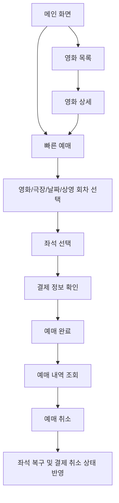
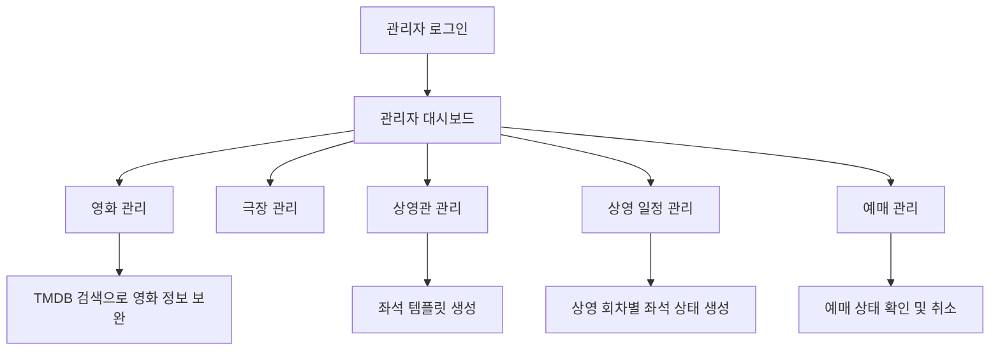
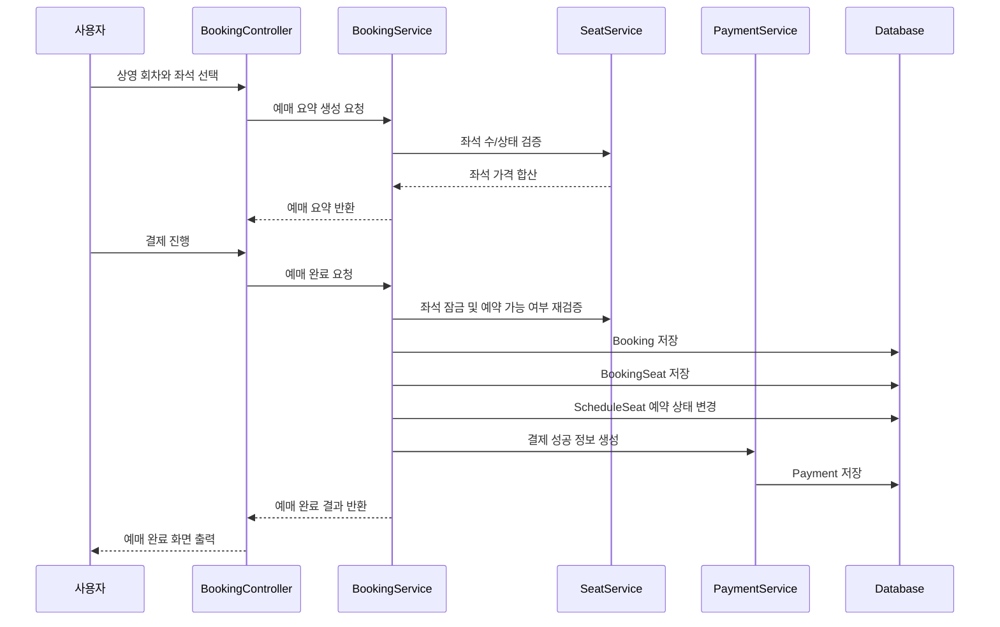
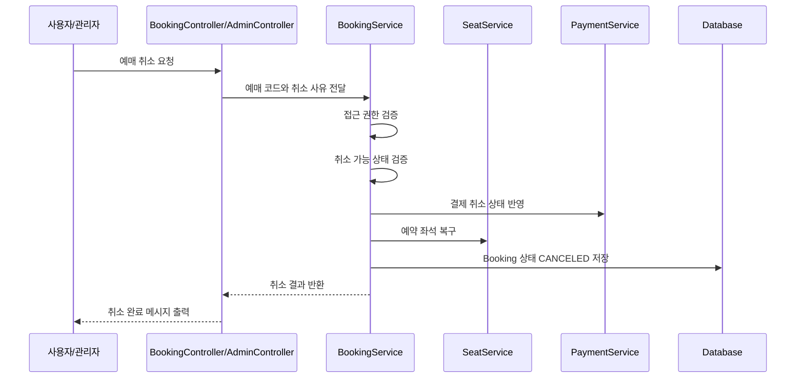
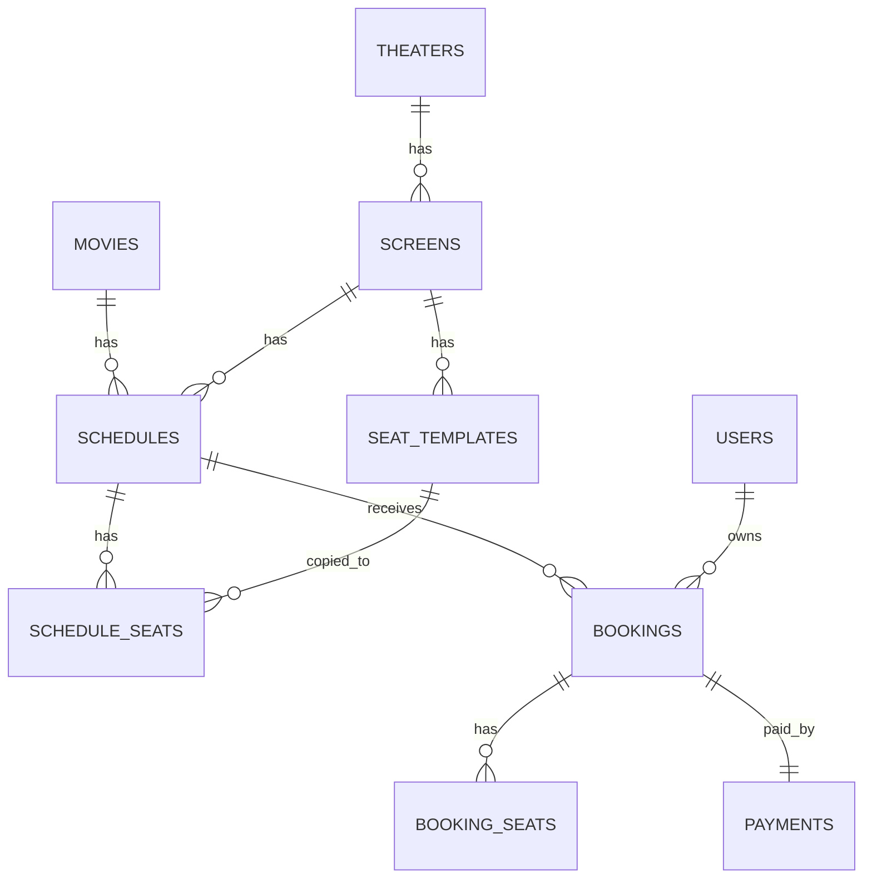
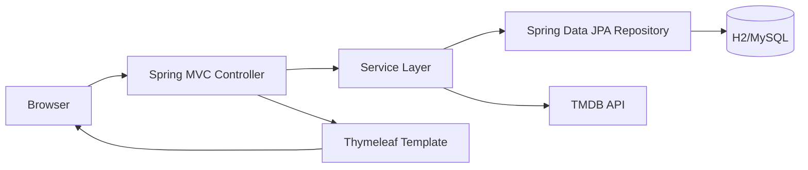

# CineFlow Spring Boot

Spring Boot와 Thymeleaf로 구현한 영화 예매 웹 애플리케이션입니다.  
영화 탐색, 상영 일정 선택, 좌석 선택, 결제 완료, 예매 내역 조회, 예매 취소, 관리자 운영 기능까지 하나의 흐름으로 연결했습니다.

기존 정적 영화 사이트 템플릿을 단순히 화면만 옮긴 것이 아니라, 영화관 예매 서비스에 필요한 핵심 데이터를 서버에서 관리하도록 재구성했습니다.  
사용자는 현재 상영작과 상영 일정을 확인한 뒤 좌석을 선택하고 예매를 완료할 수 있으며, 관리자는 영화·극장·상영관·상영일정·예매 상태를 운영할 수 있습니다.

## 프로젝트 요약

| 항목 | 내용 |
| --- | --- |
| 프로젝트명 | CineFlow |
| 개발 형태 | 개인 프로젝트 |
| 핵심 주제 | 영화 예매 및 영화관 운영 관리 웹 서비스 |
| 주요 사용자 | 일반 사용자, 비회원 예매자, 관리자 |
| 백엔드 | Spring Boot 3.4.4, Java 17 |
| 화면 구성 | Thymeleaf, HTML, CSS, JavaScript |
| 데이터 접근 | Spring Data JPA |
| 인증/인가 | Spring Security, BCrypt |
| DB | H2(dev), MySQL(local) |
| DB 마이그레이션 | Flyway |
| 외부 API | TMDB API |
| 주요 구현 범위 | 영화 조회, 빠른 예매, 좌석 선택, 결제 처리, 예매 조회/취소, 관리자 CRUD |

## 개발 목적

이 프로젝트는 영화 예매 사이트의 사용자 화면과 관리자 운영 화면을 함께 구성하는 것을 목표로 했습니다.

단순 목록 출력이나 정적 페이지 이동이 아니라, 다음과 같은 실제 서비스 흐름을 구현하는 데 집중했습니다.

- 영화 데이터와 TMDB 메타데이터를 결합한 영화 탐색 화면
- 영화, 극장, 날짜, 상영 회차를 단계적으로 선택하는 빠른 예매 흐름
- 상영 회차별 좌석 상태 관리
- 좌석 타입에 따른 가격 계산
- 예매 완료 시 좌석 점유 처리
- 결제 성공/취소 상태 관리
- 회원 예매와 비회원 예매 조회 분리
- 관리자 전용 운영 페이지 구성
- H2 개발 환경과 MySQL 로컬 환경 분리
- Flyway 기반 스키마 버전 관리

## 핵심 기능

### 1. 메인 화면

메인 화면은 TMDB 인기 영화, 현재 상영 영화, 개봉 예정 영화, 로컬 시드 데이터를 조합해서 구성됩니다.

구현 포인트는 다음과 같습니다.

- TMDB 인기 영화 기반 히어로 영역 구성
- 현재 상영작, 개봉 예정작 섹션 분리
- TMDB API 실패 또는 토큰 미설정 시 로컬 영화 데이터로 fallback
- 대표 영화, 박스오피스, 현재 상영, 개봉 예정 데이터를 각각 모델에 주입
- 사용자가 API 설정 없이도 dev 환경에서 화면을 확인할 수 있도록 구성

관련 파일

| 파일 | 역할 |
| --- | --- |
| `src/main/java/com/cineflow/controller/HomeController.java` | 메인 화면 요청 처리 |
| `src/main/java/com/cineflow/service/PublicMovieMetadataService.java` | TMDB/로컬 영화 메타데이터 통합 |
| `src/main/resources/templates/index.html` | 메인 화면 템플릿 |

### 2. 영화 목록 및 상세 화면

영화 목록은 TMDB의 now playing, popular, upcoming 목록과 로컬 활성 영화 데이터를 병합해 구성됩니다.

영화 상세 화면에서는 단순 영화 정보만 보여주는 것이 아니라, 로컬 영화와 연결된 경우 해당 영화의 상영관, 상영일정, 다음 상영 회차까지 함께 제공합니다.

구현 포인트는 다음과 같습니다.

- `/movies`에서 영화 목록 제공
- `/movies/{id}`에서 영화 상세 제공
- 기존 정적 URL인 `/movielist.html`, `/moviesingle.html`은 새 라우트로 redirect
- TMDB 영화 ID와 로컬 영화 ID를 모두 고려한 상세 조회
- 연결된 로컬 영화가 있으면 상영 일정과 극장 정보 출력
- 관련 영화 목록 제공

관련 파일

| 파일 | 역할 |
| --- | --- |
| `src/main/java/com/cineflow/controller/MovieController.java` | 영화 목록/상세 라우팅 |
| `src/main/java/com/cineflow/service/MovieService.java` | 로컬 영화 데이터 관리 |
| `src/main/java/com/cineflow/service/ScheduleService.java` | 영화별 상영 일정 조회 |
| `src/main/resources/templates/movies/list.html` | 영화 목록 화면 |
| `src/main/resources/templates/movies/detail.html` | 영화 상세 화면 |

### 3. 빠른 예매

빠른 예매 화면은 영화, 극장, 날짜, 상영 회차를 선택하는 예매 진입점입니다.

선택값이 없을 때는 예매 가능한 첫 영화와 날짜를 기준으로 기본 상태를 구성하고, 상영 회차가 전달된 경우 해당 회차에 맞춰 영화·극장·날짜를 자동으로 역산합니다.

구현 포인트는 다음과 같습니다.

- 영화 선택
- 극장 선택
- 예매 가능한 날짜 선택
- 상영 회차 선택
- 선택한 회차 기준으로 좌석 선택 화면 이동
- 기존 정적 URL `/booking.html` 지원
- 쿼리스트링 보존 redirect 처리

관련 파일

| 파일 | 역할 |
| --- | --- |
| `src/main/java/com/cineflow/controller/BookingController.java` | 예매 화면 전체 흐름 제어 |
| `src/main/java/com/cineflow/service/MovieService.java` | 예매 가능한 영화 조회 |
| `src/main/java/com/cineflow/service/TheaterService.java` | 영화별 극장 조회 |
| `src/main/java/com/cineflow/service/ScheduleService.java` | 날짜/상영 회차 조회 |
| `src/main/resources/templates/booking/quick.html` | 빠른 예매 화면 |

### 4. 좌석 선택

좌석 선택은 상영 회차별 좌석 상태를 기반으로 구성됩니다.

좌석은 상영관의 좌석 템플릿을 기준으로 생성되고, 각 상영 회차마다 `schedule_seats`로 좌석 상태를 별도 관리합니다.  
이 구조 덕분에 같은 상영관이라도 상영 회차마다 예약 상태가 독립적으로 관리됩니다.

구현 포인트는 다음과 같습니다.

- 상영관 좌석 템플릿 생성
- 상영 회차별 좌석 상태 생성
- 예약 완료 좌석 비활성화
- 좌석 코드 정규화
- 인원 수와 선택 좌석 수 검증
- STANDARD, PREMIUM, COUPLE 좌석 타입별 가격 계산
- 예매 완료 시 좌석 잠금 처리
- 예매 취소 시 좌석 복구

좌석 타입별 가격 정책

| 좌석 타입 | 가격 정책 |
| --- | --- |
| STANDARD | 상영 회차 기본 가격 |
| PREMIUM | 기본 가격 + 3,000원 |
| COUPLE | 기본 가격 + 5,000원 |

관련 파일

| 파일 | 역할 |
| --- | --- |
| `src/main/java/com/cineflow/service/SeatService.java` | 좌석 배치, 검증, 가격 계산, 예약/복구 처리 |
| `src/main/java/com/cineflow/repository/ScheduleSeatRepository.java` | 상영 회차 좌석 조회 및 잠금 |
| `src/main/resources/templates/booking/seat.html` | 좌석 선택 화면 |

### 5. 결제 및 예매 완료

결제 단계는 실제 PG 연동 대신 예매 서비스 내부에서 결제 성공 상태를 생성하는 방식으로 구성했습니다.

예매 완료 시 다음 데이터가 함께 생성됩니다.

- 예매 정보
- 선택 좌석 스냅샷
- 결제 정보
- 예매 코드
- 결제 거래번호
- 상영 회차의 잔여 좌석 수

구현 포인트는 다음과 같습니다.

- 결제 전 예매 요약 생성
- 사용자 입력값 검증
- 좌석 선점/예약 처리
- 예매 코드 생성
- 결제 거래번호 생성
- 예매 완료 화면에서 결제 결과 출력
- 회원 예매는 사용자 계정과 연결
- 비회원 예매는 예매번호와 연락처 기반 조회 가능

예매 코드 예시

```text
CF20260405-1530-A1B2
```

결제 거래번호 예시

```text
PAY-20260405153022-A1B2C3
CAN-20260405154011-D4E5F6
```

관련 파일

| 파일 | 역할 |
| --- | --- |
| `src/main/java/com/cineflow/service/BookingService.java` | 예매 생성, 좌석 반영, 취소 처리 |
| `src/main/java/com/cineflow/service/PaymentService.java` | 결제 성공/취소 상태 생성 |
| `src/main/resources/templates/booking/payment.html` | 결제 화면 |
| `src/main/resources/templates/booking/complete.html` | 예매 완료 화면 |

### 6. 예매 내역 조회 및 취소

예매 내역은 회원과 비회원 흐름을 분리했습니다.

회원은 로그인 후 마이페이지에서 본인 예매를 확인할 수 있고, 비회원은 예매번호와 연락처로 조회할 수 있습니다.  
예매 취소는 상영 시작 전, 결제 완료 상태의 예매만 가능하도록 검증합니다.

구현 포인트는 다음과 같습니다.

- 현재 예매, 지난 예매, 취소 예매 분리
- 회원 예매 내역 조회
- 비회원 예매번호 조회
- 연락처 검증
- 예매 접근 권한 검증
- 상영 시작 전 취소 제한
- 취소 시 결제 상태 `CANCELED` 변경
- 취소 시 좌석 예약 상태 복구

관련 파일

| 파일 | 역할 |
| --- | --- |
| `src/main/java/com/cineflow/controller/BookingController.java` | 예매 내역/취소 요청 처리 |
| `src/main/java/com/cineflow/service/BookingService.java` | 예매 접근 권한, 취소 가능 여부, 취소 처리 |
| `src/main/resources/templates/booking/history.html` | 예매 내역 화면 |

### 7. 회원가입 및 로그인

회원가입은 Spring Security와 JPA 기반으로 구현했습니다.

구현 포인트는 다음과 같습니다.

- 로그인 ID 중복 검사
- 이메일 중복 검사
- 비밀번호 확인 검증
- 비밀번호 BCrypt 암호화 저장
- 사용자 권한 USER/ADMIN 분리
- 로그인 사용자는 예매 시 이름과 연락처 자동 반영
- 관리자 페이지는 ADMIN 권한만 접근 가능

관련 파일

| 파일 | 역할 |
| --- | --- |
| `src/main/java/com/cineflow/controller/AuthController.java` | 로그인/회원가입 화면 처리 |
| `src/main/java/com/cineflow/service/UserService.java` | 회원가입, 관리자 생성, 사용자 조회 |
| `src/main/java/com/cineflow/config/SecurityConfig.java` | 인증/인가 설정 |
| `src/main/resources/templates/auth/login.html` | 로그인 화면 |
| `src/main/resources/templates/auth/signup.html` | 회원가입 화면 |

### 8. 관리자 페이지

관리자 페이지는 단순 대시보드가 아니라 영화관 운영 데이터를 관리하는 기능으로 구성했습니다.

관리자는 다음 데이터를 관리할 수 있습니다.

- 영화
- 극장
- 상영관
- 상영 일정
- 예매 목록
- 상영 회차별 좌석 현황
- 예매 취소

구현 포인트는 다음과 같습니다.

- `/admin` 관리자 대시보드
- 전체 영화 수, 상영 일정 수, 예매 수, 매출 합계 집계
- 오늘 상영 일정 조회
- 최근 예매 조회
- 영화 CRUD
- 극장 CRUD
- 상영관 CRUD
- 상영 일정 CRUD
- 관리자 예매 필터링
- 관리자 예매 취소
- 상영 회차 상세에서 예약/잔여 좌석 수 확인

관련 파일

| 파일 | 역할 |
| --- | --- |
| `src/main/java/com/cineflow/controller/AdminController.java` | 관리자 대시보드, 예매, 일정 조회 |
| `src/main/java/com/cineflow/controller/AdminManagementController.java` | 영화/극장/상영관/일정 관리 |
| `src/main/java/com/cineflow/controller/AdminMovieTmdbController.java` | 관리자 TMDB 검색 |
| `src/main/resources/templates/admin/index.html` | 관리자 대시보드 |
| `src/main/resources/templates/admin/bookings.html` | 관리자 예매 관리 |
| `src/main/resources/templates/admin/schedules.html` | 관리자 상영 일정 관리 |
| `src/main/resources/templates/admin/schedule-detail.html` | 상영 회차 상세 |
| `src/main/resources/templates/admin/movies.html` | 영화 관리 |
| `src/main/resources/templates/admin/theaters.html` | 극장 관리 |
| `src/main/resources/templates/admin/screens.html` | 상영관 관리 |

## 사용자 흐름



## 관리자 흐름



## 데이터 흐름

### 예매 생성 흐름



### 예매 취소 흐름



## DB 설계

이 프로젝트는 Flyway 마이그레이션으로 스키마를 관리합니다.

주요 테이블은 다음과 같습니다.

| 테이블 | 역할 |
| --- | --- |
| `movies` | 영화 정보 |
| `theaters` | 극장 정보 |
| `screens` | 극장 내 상영관 정보 |
| `seat_templates` | 상영관 기준 좌석 템플릿 |
| `schedules` | 영화 상영 회차 |
| `schedule_seats` | 상영 회차별 좌석 상태 |
| `bookings` | 예매 정보 |
| `booking_seats` | 예매 시점의 좌석 스냅샷 |
| `payments` | 결제 정보 |
| `users` | 회원 및 관리자 계정 |

ERD 개요



제약 조건과 인덱스도 함께 관리합니다.

- `booking_code` unique
- `payments.booking_id` unique
- `payments.transaction_id` unique
- `seat_templates(screen_id, seat_code)` unique
- `schedule_seats(schedule_id, seat_template_id)` unique
- `booking_seats(booking_id, seat_code)` unique
- 영화 상태, 개봉일, 극장 지역, 상영 시작 시간, 예매 상태, 결제 상태 인덱스 구성

## API

화면은 Thymeleaf 기반이지만, 일부 데이터는 JSON API로도 제공합니다.

| Method | URL | 인증 | 설명 |
| --- | --- | --- | --- |
| GET | `/api/movies` | 불필요 | 영화 목록 조회 |
| GET | `/api/movies/{id}` | 불필요 | 영화 단건 조회 |
| GET | `/api/bookings/current` | 필요 | 로그인 사용자의 현재 예매 조회 |
| GET | `/api/bookings/past` | 필요 | 로그인 사용자의 지난 예매 조회 |
| GET | `/admin/movies/tmdb/search` | 관리자 | TMDB 영화 검색 |
| GET | `/admin/movies/tmdb/{tmdbId}` | 관리자 | TMDB 영화 상세 조회 |

## 주요 URL

### 사용자 화면

| URL | 설명 |
| --- | --- |
| `/` | 메인 화면 |
| `/movies` | 영화 목록 |
| `/movies/{id}` | 영화 상세 |
| `/booking` | 빠른 예매 |
| `/booking/seat` | 좌석 선택 |
| `/booking/payment` | 결제 |
| `/booking/complete` | 예매 완료 |
| `/booking/history` | 비회원/공통 예매 조회 |
| `/mypage/bookings` | 회원 예매 내역 |
| `/support` | 고객지원 |
| `/login` | 로그인 |
| `/signup` | 회원가입 |

### 관리자 화면

| URL | 설명 |
| --- | --- |
| `/admin` | 관리자 대시보드 |
| `/admin/bookings` | 예매 관리 |
| `/admin/schedules` | 상영 일정 관리 |
| `/admin/schedules/{id}` | 상영 회차 상세 |
| `/admin/movies` | 영화 관리 |
| `/admin/movies/new` | 영화 등록 |
| `/admin/theaters` | 극장 관리 |
| `/admin/screens` | 상영관 관리 |
| `/admin/schedules/new` | 상영 일정 등록 |

### 레거시 URL 호환

기존 정적 템플릿 URL도 새 라우트로 연결되도록 처리했습니다.

| 기존 URL | 연결 URL |
| --- | --- |
| `/index.html` | `/` |
| `/movielist.html` | `/movies` |
| `/moviesingle.html?id=...` | `/movies/{id}` |
| `/booking.html` | `/booking` |
| `/booking-seat.html` | `/booking/seat` |
| `/booking-payment.html` | `/booking/payment` |
| `/booking-complete.html` | `/booking/complete` |
| `/booking-history.html` | `/booking/history` |
| `/support.html` | `/support` |

## 기술 스택

### Backend

| 기술 | 사용 목적 |
| --- | --- |
| Java 17 | Spring Boot 3.x 실행 환경 |
| Spring Boot 3.4.4 | 웹 애플리케이션 기반 |
| Spring MVC | Controller 기반 요청 처리 |
| Spring Data JPA | Entity/Repository 기반 데이터 접근 |
| Spring Security | 로그인, 권한 분리, 접근 제어 |
| Bean Validation | 폼 입력값 검증 |
| Lombok | DTO/Entity/Service 코드 간결화 |
| RestClient | TMDB API 호출 |
| Flyway | DB 스키마 마이그레이션 |

### Frontend

| 기술 | 사용 목적 |
| --- | --- |
| Thymeleaf | 서버 사이드 렌더링 |
| HTML/CSS | 화면 구조와 스타일 |
| JavaScript | 예매/좌석 선택 화면 상호작용 |
| Thymeleaf Security Extras | 로그인/권한 기반 화면 분기 |

### Database

| 환경 | DB |
| --- | --- |
| dev | H2 in-memory |
| local | MySQL |

## 아키텍처



계층별 책임은 다음과 같이 분리했습니다.

| 계층 | 책임 |
| --- | --- |
| Controller | 요청 파라미터 처리, 화면 모델 구성, redirect 흐름 제어 |
| Service | 비즈니스 규칙, 예매 검증, 좌석 처리, 결제 상태 처리 |
| Repository | JPA 기반 데이터 조회/저장 |
| Domain | 영화, 극장, 상영관, 예매, 결제, 회원 등 핵심 엔티티 |
| DTO/Form | 화면 출력과 폼 입력 데이터 전달 |
| Template | 사용자/관리자 화면 렌더링 |

## 패키지 구조

```text
src/main/java/com/cineflow
├── api
│   ├── BookingApiController.java
│   └── MovieApiController.java
├── config
│   ├── SecurityConfig.java
│   └── TmdbProperties.java
├── controller
│   ├── AdminController.java
│   ├── AdminManagementController.java
│   ├── AdminMovieTmdbController.java
│   ├── AuthController.java
│   ├── BookingController.java
│   ├── HomeController.java
│   ├── MovieController.java
│   └── SupportController.java
├── domain
│   ├── Booking.java
│   ├── BookingSeat.java
│   ├── Movie.java
│   ├── Payment.java
│   ├── Schedule.java
│   ├── ScheduleSeat.java
│   ├── Screen.java
│   ├── SeatTemplate.java
│   ├── Theater.java
│   └── User.java
├── dto
├── repository
├── security
└── service
```

```text
src/main/resources
├── db/migration
│   ├── V1__init_schema.sql
│   ├── V2__indexes_and_constraints.sql
│   ├── V3__auth_schema.sql
│   └── V4__booking_user_relation.sql
├── templates
│   ├── admin
│   ├── auth
│   ├── booking
│   ├── movies
│   ├── support
│   └── index.html
├── application.yml
├── application-dev.yml
└── application-local.yml
```

## 구현 근거

### 예매 도메인

| 구현 내용 | 파일 |
| --- | --- |
| 예매 요약 생성 | `BookingService.createBookingSummary()` |
| 예매 완료 처리 | `BookingService.completeBooking()` |
| 예매 코드 생성 | `BookingService.generateBookingCode()` |
| 예매 취소 처리 | `BookingService.cancelBooking()` |
| 본인 예매 접근 검증 | `BookingService.canAccessBooking()` |
| 취소 가능 여부 검증 | `BookingService.validateCancelable()` |

### 좌석 도메인

| 구현 내용 | 파일 |
| --- | --- |
| 좌석 배치 조회 | `SeatService.getSeatLayout()` |
| 예약 좌석 조회 | `SeatService.getReservedSeatCodes()` |
| 좌석 코드 정규화 | `SeatService.normalizeSeatCodes()` |
| 좌석 선택 검증 | `SeatService.validateSeatSelection()` |
| 좌석 가격 계산 | `SeatService.calculateTotalPrice()` |
| 좌석 잠금 조회 | `ScheduleSeatRepository.findForUpdateByScheduleIdAndSeatCodes()` |
| 예약 취소 시 좌석 복구 | `SeatService.releaseReservedSeatsForBooking()` |

### 결제 도메인

| 구현 내용 | 파일 |
| --- | --- |
| 결제 성공 처리 | `PaymentService.processSuccessfulPayment()` |
| 결제 취소 처리 | `PaymentService.cancelPayment()` |
| 결제 거래번호 생성 | `PaymentService.generateTransactionId()` |
| 취소 거래번호 생성 | `PaymentService.generateCancelTransactionId()` |

### TMDB 메타데이터

| 구현 내용 | 파일 |
| --- | --- |
| 인기 영화 조회 | `TmdbClient.getPopularMovies()` |
| 현재 상영작 조회 | `TmdbClient.getNowPlayingMovies()` |
| 개봉 예정작 조회 | `TmdbClient.getUpcomingMovies()` |
| 영화 상세 조회 | `TmdbClient.getMovieDetailWithMedia()` |
| 로컬 fallback | `PublicMovieMetadataService.buildFallbackMetadata()` |
| TTL 캐시 | `PublicMovieMetadataService.resolveFromTtlCache()` |
| TMDB 실패 처리 | `PublicMovieMetadataService.resolveMetadata()` |

## 보안 설계

Spring Security 설정을 통해 공개 화면, 로그인 필요 화면, 관리자 화면을 분리했습니다.

| 구분 | 접근 정책 |
| --- | --- |
| 메인/영화/예매 기본 화면 | 전체 공개 |
| 회원 예매 내역 | 로그인 필요 |
| `/api/bookings/**` | 로그인 필요 |
| `/admin/**` | ADMIN 권한 필요 |
| H2 Console | dev 편의를 위해 frame same-origin 허용 |
| 비밀번호 저장 | BCrypt 해시 적용 |

로그인 처리 정책

| 항목 | 값 |
| --- | --- |
| 로그인 페이지 | `/login` |
| 로그인 처리 URL | `/login` |
| 아이디 파라미터 | `loginId` |
| 비밀번호 파라미터 | `password` |
| 로그인 성공 기본 URL | `/admin` |
| 로그아웃 URL | `/logout` |

## TMDB 연동 설계

TMDB API는 영화 화면의 실제감과 데이터 품질을 높이기 위해 사용했습니다.

다만 API 토큰이 없거나 네트워크 오류가 발생해도 서비스 화면이 깨지지 않도록 fallback 구조를 구성했습니다.

처리 방식은 다음과 같습니다.

1. TMDB 토큰이 있으면 TMDB API 호출
2. TMDB 영화 ID가 있으면 상세 조회 우선
3. TMDB 영화 ID가 없으면 제목과 개봉연도로 검색 매칭
4. TMDB 응답이 있으면 실시간 메타데이터로 화면 구성
5. TMDB 실패 또는 미설정이면 로컬 영화 데이터로 fallback
6. 실시간 메타데이터는 5분 TTL 캐시 적용
7. fallback 메타데이터는 30초 TTL 캐시 적용

TMDB 설정 값

| 설정 | 설명 |
| --- | --- |
| `tmdb.base-url` | TMDB API base URL |
| `tmdb.image-base-url` | TMDB 이미지 base URL |
| `tmdb.language` | 응답 언어 |
| `TMDB_BEARER_TOKEN` | TMDB API bearer token |

## 예외 및 안정성 처리

이 프로젝트에서 중점적으로 처리한 안정성 요소입니다.

| 상황 | 처리 방식 |
| --- | --- |
| 상영 회차 미선택 | 빠른 예매 화면으로 redirect |
| 존재하지 않는 상영 회차 | 오류 메시지 후 다시 선택 유도 |
| 좌석 수와 인원 수 불일치 | 예매 진행 차단 |
| 이미 예약된 좌석 포함 | 예매 완료 차단 |
| TMDB 미설정 | 로컬 데이터 fallback |
| TMDB 네트워크 오류 | 로그 기록 후 fallback |
| 비회원 예매 조회 실패 | 오류 메시지 출력 |
| 본인 예매가 아닌 경우 | 접근 차단 |
| 이미 취소된 예매 | 중복 취소 차단 |
| 상영 시작 이후 취소 | 취소 차단 |
| 외부 redirect 위험 | 안전한 내부 경로만 허용 |

## 테스트

현재 테스트는 TMDB 메타데이터 처리의 핵심 분기를 중심으로 작성했습니다.

주요 검증 항목은 다음과 같습니다.

- TMDB 상세 정보가 로컬 표시 정보와 결합되는지 검증
- TMDB ID가 없을 때 제목 기반 검색을 수행하는지 검증
- 제목이 일치하지 않는 TMDB 검색 결과를 무리하게 사용하지 않는지 검증
- 인기 영화 목록과 로컬 영화 연결이 정상 동작하는지 검증
- 로컬 영화가 없을 때 TMDB route id로 상세 조회하는지 검증
- TMDB가 미설정일 때 로컬 fallback이 동작하는지 검증
- TTL 캐시가 반복 호출을 줄이는지 검증
- TTL 만료 후 캐시가 갱신되는지 검증

관련 파일

| 파일 | 역할 |
| --- | --- |
| `src/test/java/com/cineflow/service/PublicMovieMetadataServiceTest.java` | TMDB/로컬 메타데이터 병합 및 캐시 테스트 |

테스트 실행

```powershell
.\gradlew.bat test
```

## 실행 환경

| 항목 | 버전/설정 |
| --- | --- |
| Java | 17 |
| Spring Boot | 3.4.4 |
| Gradle | Gradle Wrapper |
| 기본 프로필 | dev |
| dev DB | H2 in-memory |
| local DB | MySQL |

## 실행 방법

실행법은 프로젝트 설명의 중심이 아니므로 하단에 정리했습니다.

### dev 실행

H2 in-memory DB와 seed 데이터를 사용하는 개발용 실행입니다.

```powershell
.\gradlew.bat bootRun
```

또는 명시적으로 dev 프로필을 지정할 수 있습니다.

```powershell
.\gradlew.bat bootRun --args="--spring.profiles.active=dev"
```

dev 프로필 특징

| 항목 | 내용 |
| --- | --- |
| DB | H2 in-memory |
| H2 Console | `/h2-console` |
| JPA ddl-auto | update |
| Seed | 활성화 |
| 용도 | 빠른 시연 및 개발 확인 |

### local 실행

MySQL을 사용하는 로컬 실행입니다.

DB 생성

```sql
CREATE DATABASE cineflow
  CHARACTER SET utf8mb4
  COLLATE utf8mb4_unicode_ci;
```

환경변수 예시

```powershell
$env:MYSQL_HOST="localhost"
$env:MYSQL_PORT="3306"
$env:MYSQL_DATABASE="cineflow"
$env:MYSQL_USERNAME="root"
$env:MYSQL_PASSWORD="your-local-mysql-password"
$env:SPRING_PROFILES_ACTIVE="local"
.\gradlew.bat bootRun
```

local 프로필 특징

| 항목 | 내용 |
| --- | --- |
| DB | MySQL |
| JPA ddl-auto | validate |
| Flyway | 활성화 |
| Seed | 기본 비활성 |
| 용도 | 실제 DB 기반 로컬 검증 |

Seed 데이터가 필요하면 다음 환경변수를 설정합니다.

```powershell
$env:APP_SEED_ENABLED="true"
```

### TMDB 토큰 설정

TMDB API를 사용하려면 bearer token을 환경변수로 설정합니다.

```powershell
$env:TMDB_BEARER_TOKEN="your-tmdb-bearer-token"
```

토큰이 없어도 로컬 seed/fallback 데이터로 주요 화면은 동작하도록 구성했습니다.

## 관리자 계정

dev 시연 환경에서는 seed 설정으로 관리자 계정을 생성할 수 있습니다.

사용 가능한 환경변수는 다음과 같습니다.

| 환경변수 | 설명 |
| --- | --- |
| `ADMIN_USERNAME` | 관리자 로그인 ID |
| `ADMIN_PASSWORD` | 관리자 비밀번호 |
| `ADMIN_EMAIL` | 관리자 이메일 |
| `ADMIN_NAME` | 관리자 이름 |
| `ADMIN_PHONE` | 관리자 연락처 |

공개 저장소에는 실제 비밀번호나 토큰을 넣지 않습니다.  
시연 또는 운영 전에 `ADMIN_PASSWORD`는 반드시 안전한 값으로 변경해야 합니다.

## 환경 설정 파일

| 파일 | 설명 |
| --- | --- |
| `application.yml` | 공통 설정 |
| `application-dev.yml` | H2 기반 개발 프로필 |
| `application-local.yml` | MySQL 기반 로컬 프로필 |

공통 설정의 핵심은 다음과 같습니다.

- 기본 active profile은 `dev`
- 서버 포트는 `8080`
- Hibernate timezone은 `Asia/Seoul`
- Flyway migration 위치는 `classpath:db/migration`
- TMDB 토큰은 환경변수에서 주입

## 마이그레이션

Flyway 마이그레이션 파일은 다음 순서로 적용됩니다.

| 파일 | 내용 |
| --- | --- |
| `V1__init_schema.sql` | 영화, 극장, 상영관, 일정, 좌석, 예매, 결제 기본 스키마 |
| `V2__indexes_and_constraints.sql` | unique 제약 조건 및 인덱스 |
| `V3__auth_schema.sql` | 사용자/관리자 인증 스키마 |
| `V4__booking_user_relation.sql` | 예매와 사용자 관계 추가 |

## 포트폴리오 관점에서의 구현 포인트

이 프로젝트에서 강조할 수 있는 부분은 다음과 같습니다.

### 단순 화면 구현이 아닌 예매 도메인 구현

영화 예매는 단순히 폼을 저장하는 기능이 아니라, 상영 회차, 좌석 상태, 인원 수, 결제 상태가 함께 맞아야 합니다.  
이 프로젝트는 좌석 선택부터 예매 완료, 취소 후 좌석 복구까지 하나의 트랜잭션 흐름으로 구성했습니다.

### 좌석 상태를 회차별로 분리

상영관 좌석 자체와 상영 회차별 좌석 상태를 분리했습니다.  
이를 통해 같은 상영관을 여러 영화/시간대가 공유하더라도 각 회차의 좌석 예약 상태를 독립적으로 관리할 수 있습니다.

### 관리자 운영 기능 포함

사용자 화면만 구현한 것이 아니라, 관리자 화면에서 영화·극장·상영관·상영일정을 운영할 수 있도록 구성했습니다.  
특히 상영관 등록 이후 좌석 템플릿을 만들고, 상영 일정 등록 시 회차별 좌석 상태를 생성하는 흐름은 영화 예매 서비스의 운영 구조를 보여줍니다.

### 외부 API 실패를 고려한 fallback

TMDB API는 영화 데이터를 풍부하게 만들지만, 외부 API에만 의존하면 로컬 실행과 시연 안정성이 떨어집니다.  
이 프로젝트는 TMDB가 미설정이거나 실패해도 로컬 데이터로 화면이 유지되도록 설계했습니다.

### 개발/로컬 환경 분리

H2 기반 dev 환경과 MySQL 기반 local 환경을 분리했습니다.  
개발 중에는 빠르게 실행하고, 로컬 DB 검증 시에는 Flyway와 MySQL을 사용해 실제 운영에 가까운 환경으로 확인할 수 있습니다.

## 개선 예정

향후 확장할 수 있는 기능입니다.

- 실제 결제 PG 연동
- 예매 좌석 임시 홀드 만료 배치 처리
- 영화 검색/필터 고도화
- 관리자 통계 차트 추가
- 예매 알림 메일 또는 문자 발송
- 사용자 마이페이지 정보 수정
- 예매 취소 수수료 정책 추가
- 상영관 좌석 배치 커스터마이징 UI
- Docker Compose 기반 MySQL 실행 환경 추가
- API 문서화

## 보안 주의사항

공개 저장소에 다음 값은 커밋하지 않습니다.

- `TMDB_BEARER_TOKEN`
- MySQL 비밀번호
- 관리자 계정 실제 비밀번호
- `.env`
- `application-secret.yml`
- `application-private.yml`

이미 공개 저장소에 secret이 올라간 적이 있다면 해당 값은 즉시 재발급해야 합니다.

## 한 줄 소개

CineFlow는 영화 조회부터 좌석 선택, 결제, 예매 내역, 관리자 운영까지 연결한 Spring Boot 기반 영화 예매 웹 애플리케이션입니다.